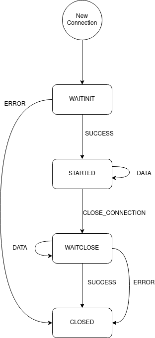

# The ContainerSSH Agent protocol

The ContainerSSH Agent protocol allows for forwarding and reverse-forwarding several types of connections within the container: X11, TCP, etc. The protocol is designed to be symmetrical in a way that both ends can request, accept/reject, and process connections and both ends have the same capabilities during a connection. However, there is a small client/server distinction while initializing the protocol in the initial exchange: The 'Client' (ContainerSSH) sends a `SetupPacket` to the 'Server' (Agent) that specificies the mode that the agent should initialize to (e.g. forward, reverse-forward, X11 forward etc).

## Concepts

The server and the client communicate over the standard input/output using the container APIs. (Docker and Kubernetes) The agent is running just like any other program would in the container.

### Server

The server in this context is the ContainerSSH agent. It waits for connection requests from the client (ContainerSSH) and opens the corresponding sockkets.

### Client

The client in this context is ContainerSSH, opening a connection by sending requests to the agent via the standard input/output using the container API (Docker or Kubernetes).

### Connection

A Connection is a bidirectional binary communication between the server and the client. Multiple number of connections can be active at any given time and both sides (client/server) have the capacity to request a new connection. Connections are identified by a ConnectionID and each packet includes the ConnectionID to associate it with a connection. The state of connections is detailed in the following flow graph where the nodes represent the valid connection states and the edges are the actions/packets that affect the connection state.

When a connection is initiated it is in WAITINIT state until the other end issues either an Accept action, which results in a SUCCESS message and the connection starting or a Reject action whith results in an ERROR message and the connection closing. When a connection is in the STARTED state it can accept data and both sides can issue write() and read() calls to write and read from the connection. The blocking/non-blocking nature of these calls depends on the underlying communication medium. When a connection is closed from one end it is moved to the WAITCLOSE state until the other side acknowledges the close request. This is necessary to ensure that any leftover data sent after the close call is processed. Finally once the close request is acknowledged the connection is finally closed.

## Protocol

The protocol consists of messages sent in [CBOR-encoding](https://cbor.io/) in a back-to-back fashion. Other than the connection control packets described above there is additionally a 'No More Connections' packet that instructs the other side to stop accepting new connections. This is handled internally in the protocol library by closing the new connection channel.